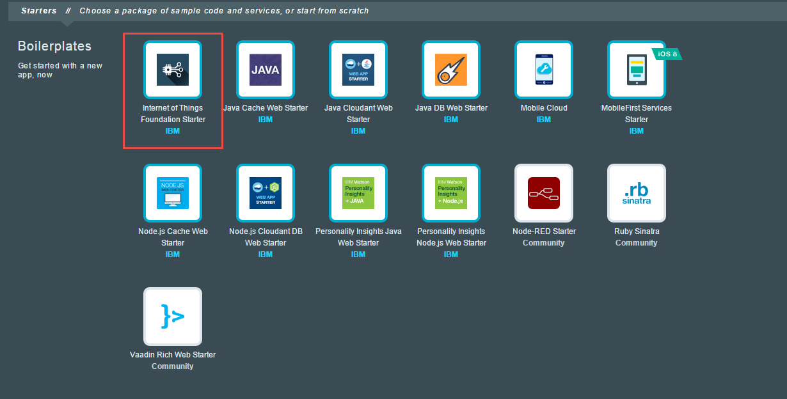
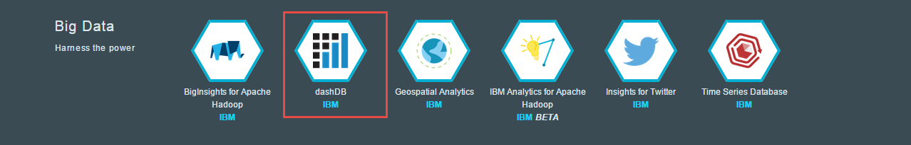
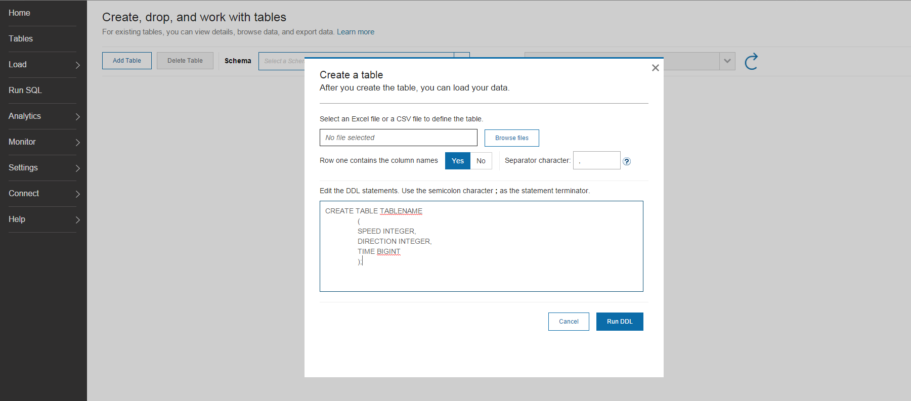
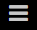
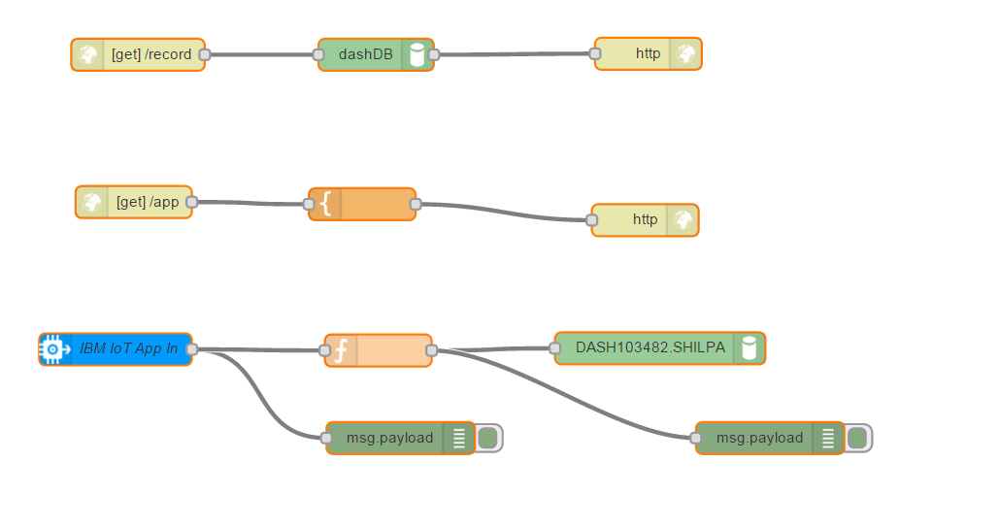
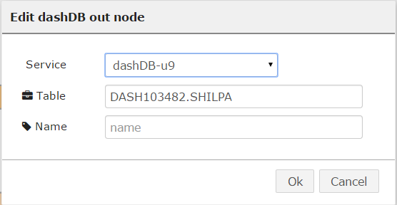
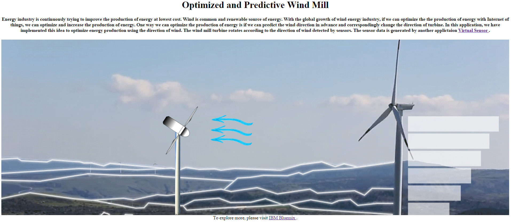

## 1.First things first: Lets set up your Bluemix accounts!
      http://ace.ng.bluemix.net
  This will take care of your Sign Up and Log In into the Bluemix portal.

## 2.Get to know our App

### What is our App?
Wind is common and renewable source of energy. With the global growth of wind energy industry, if we can optimize the the production of energy with Internet of things, we can optimize and increase the production of energy. We have used the internet of things to develop a prototypre which can optimize the production of energy usind Wind energy.

#### The app requires Internet of Things boilerplate and DashDB service from Bluemix. Internet of things boilerplate use Node-Red

A quick introduction to [Node-RED] (http://nodered.org/) would be handy. Nevertheless, we can pick the skills on the go.

## 3.Lets get started
####  Set up the Node-RED boilerplate and DashDB service
  *  Login to your Bluemix account.
  What you see here is the list of your Applications and Services in Bluemix. We are going to create a Internet of Things boilerplate application and bind a DashDB service to this application.

*Now, a Boilerplate can be imagined as a bundled Application with relevant bound Services for a particular targeted usage to get up and running quickly.*    

  * In the upper menu bar, go to __CATALOG__.
  
*This page lists all kinds of different boilerplates, runtimes and services that are offered by Bluemix. Browsing through this page can give you an idea about all the exciting features offered by Bluemix.*

* From the Boilerplates section, select the _Internet of Things_ starter boilerplate.

Here you can see the SDK for Node.JS and Cloudant No SQL Service that come as a part of the Internet of Things boilerplate. For our app, we are not going to use these bundled services. Instead we will bind our own DashDB service.

* Provide a unique name to the app on the right side of the page and click __CREATE__.
* In a couple of minutes, your application will be staging and ready to run.

*You will land up on the 'Start coding with Internet of Things' page. The instructions on this page are to get familiar with Cloud Foundry command line interface to control your application. You can go through the steps and try them out at leisure. We won't be needing that for our app right now.*

* On the left panel, click on __Overview__. This is the overview of your Application showing the link to go to the App, status of the app, instances, memory and the services bound to it.
* We want to bind the DashDB service to the App. Lets click on the __ADD A SERVICE OR API__ button.
* Search for DashDB in the search tab or select the dashDB service in the Big Data section.

* In the right hand side panel, the App name would be pre-filled and the service name would be randomly generated. The selected plan should be defaulted to Entry plan. Click __CREATE__.
* The App would be required to __RESTAGE__. Your DashDB service is now bound with the Internet of Things App and it should show up on the App Overview page.

#### We are done with the setup of the Internet of Things app and the DashDB service.

## 4. Let's create our Node-RED flow!
#### Create Table in DashDB
We need to create a table in our DashDB for storing the data for our App. Lets get that done quickly.

* On the overview page, click on the DashDB service block in the services section. Further, click on the __LAUNCH__ button on the upper right corner of the page. This will open up the DashDB console in a new tab.
* Click on Tables on the left panel. Then Click on Add Tables.
* A pop up will open. Add below statement in the text area

*Use some unique table name for the table*

* Click on Run DDL.

#### The Node-RED flow

* From the App overview page, click on the link next to __Routes__ right beneath the App name.
* This will land you on the Node-RED in BlueMix page. Click on the red button "Go to your Node-RED flow editor".

*The left panel of this page includes all the different nodes available for direct use to plug and play within your flow structures. The main area called the 'sheet' is where you pull in the nodes and connect them to each other to make a functional app. On the right panel, 'info' displays the information about a particular node when selected and the 'debug' tab is the space where we validate and visualize the state of data flowing at any time within the flow.*

* Click on plus sign to Add a New Sheet
* On the top right corner, click the icon:  and select Import > Clipboard
* In the textbox, paste the content of the file WindMill.txt in the folder files of this project. Click Ok.
* This imports the ready-to-use flow structure that you can use for this App.

###  Set the DashDb Configurations

* Double click the node "DASH103482". Add details "Schema.TableName" of your dashDB instantce. 

* Click __Deploy__
* In the debug panel on the right, you would start seeing the Speed, Direction and Time data coming from __Virtual Sensor__.
* Go back to the DashDB console and validate the records being inserted into the table we created. 

## 5. Time to see the results.
* Open a new tab. Log on to "Your App name".mybluemix.net/app
* You will app as shown below. The wind turbine is changing its direction as of wind is changing.

